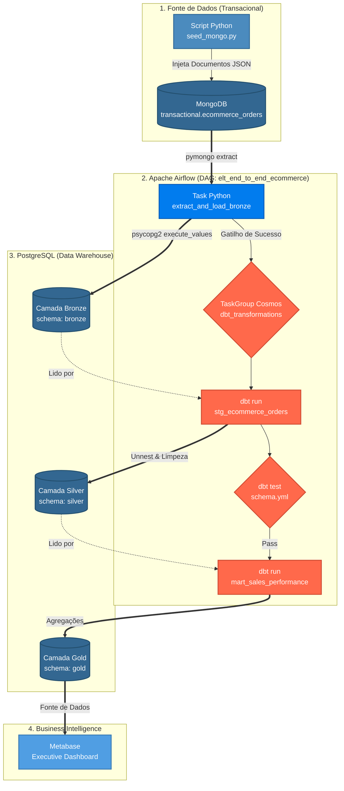
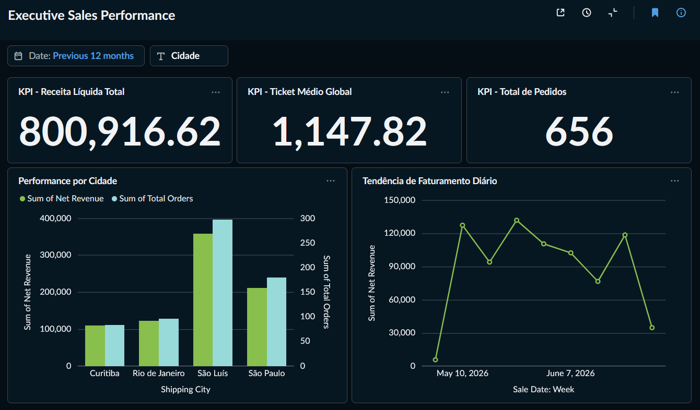

# **E-Commerce Modern Data Stack (End-to-End)**

Este repositório contém o desenvolvimento de um pipeline de dados analítico de ponta a ponta (End-to-End), simulando a infraestrutura de produção de um e-commerce de alto volume. O projeto aplica os conceitos mais modernos de Engenharia e Analytics Engineering (ELT), utilizando orquestração nativa, conteinerização e testes de qualidade de dados automatizados.

## **Objetivo do Projeto**

Construir um ambiente analítico robusto, escalável e reprodutível que extrai dados complexos e aninhados (JSON) de um banco transacional NoSQL (MongoDB), realiza a carga de forma idempotente em um Data Warehouse (PostgreSQL) e executa transformações dimensionais garantindo regras de negócio e integridade (dbt Core), culminando em um dashboard executivo interativo (Metabase).

## **Arquitetura de Dados e Fluxo End-to-End**

O fluxo de dados segue rigorosamente a arquitetura Medallion acoplada ao paradigma **ELT** (*Extract, Load, Transform*), garantindo que o dado bruto seja preservado antes de sofrer qualquer manipulação analítica.  
O diagrama abaixo ilustra a execução sistêmica e a orquestração de todas as tarefas desenvolvidas no projeto:



1. **Source (MongoDB):** Camada de origem simulando o banco transacional. Um script injeta continuamente documentos JSON altamente aninhados contendo sub-objetos de clientes, finanças e arrays de produtos com anomalias intencionais para testar a resiliência do pipeline.  
2. **Ingestion (Airflow / Camada Bronze):** Uma DAG robusta baseada em TaskFlow API extrai os dados via pymongo e realiza um Upsert seguro (ON CONFLICT) na tabela bruta no PostgreSQL, armazenando os documentos em seu estado original (tipo JSONB).  
3. **Transformation (dbt Core / Camada Silver):** Realiza o *unnest* (achata) das arrays de produtos, padroniza strings de localização, converte marcas de tempo BSON do MongoDB para timestamps nativos e aplica funções matemáticas para corrigir anomalias. Gera *Surrogate Keys* determinísticas baseadas em índices de partição para manter a granularidade rigorosa.  
4. **Data Marts (dbt Core / Camada Gold):** Consolidação das regras de negócio em tabelas otimizadas para consumo analítico, calculando métricas de Receita Bruta, Receita Líquida e Ticket Médio.  
5. **Orquestração Nativa (Cosmos):** A biblioteca Astronomer Cosmos traduz os modelos e testes do dbt em tarefas visuais nativas do Airflow, impedindo a progressão do fluxo caso regras de qualidade (schema.yml) sejam quebradas.

## **Estrutura de Pastas do Repositório**

Para a correta exibição dos ativos visuais, o projeto está estruturado da seguinte forma:

```Plaintext  
mds-mongodb-dbt-project/  
├── assets/                   
├── dags/  
│   ├── dbt_transform/       <-- Projeto dbt Core completo (Models, Macros, YAMLs)  
│   │   ├── macros/  
│   │   └── models/  
│   │       ├── staging/  
│   │       └── marts/  
│   └── elt_end_to_end.py    <-- Super DAG de Ingestão e Orquestração Cosmos  
├── scripts/  
│   └── seed_mongo.py        <-- Script gerador de dados transacionais  
├── docker-compose.override.yml  
└── requirements.txt
```

## **Desafios de Engenharia Resolvidos (Diferenciais Técnicos)**

Projetos de produção diferem de tutoriais acadêmicos por antecipar falhas de infraestrutura e volumetria. Este pipeline foi desenhado sob os seguintes padrões de engenharia:

* **Mitigação de *XCom Bloat* (Gargalo de Memória):** Em vez de trafegar o JSON bruto extraído entre tasks separadas do Airflow — o que sobrecarregaria o banco de metadados do orquestrador —, o pipeline centraliza a extração e a carga na camada Bronze em uma única unidade atômica. Os dados são descarregados em lote utilizando o método otimizado execute\_values do psycopg2.  
* **Tratamento de Mudança de Granularidade (*Grain Change*):** Na camada Bronze, o grão dos dados era **1 Linha \= 1 Pedido**. Ao achatar a array de produtos na camada Silver, o grão transformou-se em **1 Linha \= 1 Item de um Pedido**, invalidando a unicidade do ID da transação. O problema foi solucionado via SQL criando uma *Surrogate Key* com hash MD5 atrelada ao índice sequencial do array original extraído via WITH ORDINALITY.  
* **Conexões Seguras e Prevenção de Zumbis:** Implementação rigorosa de gerenciadores de contexto Python (with statements) para cursores do banco de dados, garantindo o encerramento automático das sessões mesmo em falhas de rede.  
* **Sobrescrita de Comportamento de Esquemas do dbt:** Criação de macro customizada para interceptar a lógica nativa do dbt, forçando o isolamento limpo dos esquemas silver e gold no PostgreSQL.

## **Como Reproduzir o Ambiente Localmente (Fricção Zero)**

Todo o ecossistema foi projetado para ser provisionado com comandos simples, eliminando incompatibilidades de sistemas operacionais.

### **Pré-requisitos**

* Docker e Docker Compose instalados.  
* Astro CLI configurado na máquina (ou ambiente WSL2).

### **1\. Iniciar os Containers da Infraestrutura**

Na raiz do projeto, execute o comando para compilar as imagens e levantar os serviços (Airflow, Postgres, MongoDB e Metabase) na mesma malha de rede isolada:

```Bash  
astro dev start
```

### **2\. Alimentar o Banco Transacional (Origem NoSQL)**

Abra um terminal local, ative o seu ambiente virtual e execute o script para simular a criação das compras no MongoDB:

```Bash  
python3 \-m venv .venv  
source .venv/bin/activate  
pip install \-r requirements.txt  
python scripts/seed\_mongo.py
```

### **3\. Executar o Pipeline de Dados**

* Acesse o console do **Apache Airflow** em http://localhost:8080 (credenciais padrão: admin / admin).  
* Crie a conexão estruturada do banco de dados analítico em *Admin \-\> Connections* com o ID postgres\_dw apontando para o Host postgres-dw.  
* Ative e dispare a DAG elt\_end\_to\_end\_ecommerce. O ecossistema executará a ingestão bruta e acionará o fluxo de transformações e testes.

## **Data Analytics & Business Intelligence (Dashboard)**

Com os dados limpos, validados e consolidados na camada Gold, o **Metabase** atua como camada de consumo otimizada, entregando respostas estratégicas pré-agregadas.



O dashboard responde instantaneamente a dores latentes do negócio:

*  KPIs de Alta Gestão: Visualização imediata da Receita Líquida Total acumulada, Ticket Médio Global e volume absoluto de conversões.

* Tendência de Faturamento Temporal: Mapeamento da performance financeira ao longo das semanas, expondo picos sazonais de venda.

* Visão Geográfica de Vendas: O correto tratamento de dados na etapa de Staging garante a unificação perfeita das praças, corrigindo strings corrompidas da origem para uma análise comercial comparativa precisa entre as capitais.

### **Painel de Performance de Vendas Executivas**

O dashboard responde instantaneamente a dores latentes do negócio:

* **KPIs de Alta Gestão:** Visualização imediata da Receita Líquida Total acumulada, Ticket Médio Global e volume absoluto de conversões.  
* **Tendência de Faturamento Temporal:** Mapeamento da performance financeira ao longo das semanas, expondo picos sazonais de venda.  
* **Visão Geográfica de Vendas:** O correto tratamento de dados na etapa de Staging garante a unificação perfeita das praças, corrigindo strings corrompidas da origem para uma análise comercial comparativa precisa entre as capitais (ex: exibição padronizada de *São Luís*).

## **Próximos Passos e Melhorias Contínuas**

* [ ] Implementar a conteinerização individual das tarefas de dbt utilizando DbtKubernetesOperator ou DbtDockerOperator para isolar ambientes de execução em escala de Big Data.  
* [ ] Adicionar testes de severidade customizados no dbt para disparar alertas automatizados em canais de comunicação corporativos (Slack/Teams).  
* [ ] Migrar a camada de sementes (Seeds) de Cidades para uma API de dados geográficos externa, removendo a dependência de lógicas de mapeamento estáticas no código.
